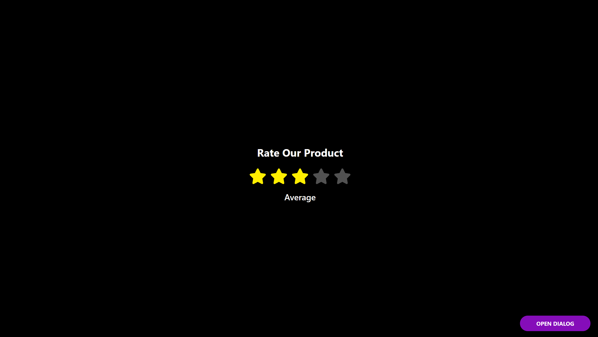

# Rating System



## Description

**Rating System** is a responsive React application that allows users to interact with a dynamic five-star rating component. Users can select a rating, view descriptive feedback text, and interact with a dialog component built using reusable React components and props.

The project was developed as part of a React front-end assignment and focuses on component-based architecture, state management with hooks, reusable UI design, and interactive user experiences.

## Features

- Interactive five-star rating system
- Dynamic rendering using React `.map()`
- Rating feedback text based on selected stars
- Reusable React components
- Dialog component with close functionality
- State management using `useState`
- Responsive and clean UI design
- Smooth hover effects and transitions
- Semantic and accessible JSX structure

## Technologies Used

### Front-End

- React
- JavaScript
- CSS
- React Icons

### Tools Used

- VS Code
- Git
- GitHub
- NPM

## Key Implementation Details

### Star Hover and Click States

Star rendering is controlled using hover and click interactions.

- `activeIndex` manages the currently hovered star
- `clickedStar` stores the selected rating value
- Stars update visually on hover and persist selection on click

```jsx
const [activeIndex, setActiveIndex] = useState(null);
const [clickedStar, setClickedStar] = useState(null);

const handleRating = (index) => {
  popSound.play();
  setClickedStar(index);
};

const handleOnHover = (index) => {
  setActiveIndex(index);
};

const handleNotHovered = () => {
  setActiveIndex(clickedStar);
};
```

## Demo

Click [here]() to demo
